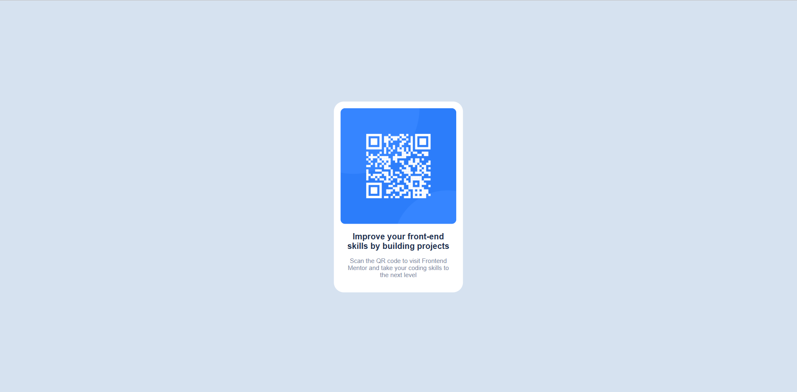

# Frontend Mentor - QR code component solution

This is a solution to the [QR code component challenge on Frontend Mentor](https://www.frontendmentor.io/challenges/qr-code-component-iux_sIO_H). Frontend Mentor challenges help you improve your coding skills by building realistic projects. 

## Table of contents

- [Overview](#overview)
  - [Screenshot](#screenshot)
- [My process](#my-process)
  - [Built with](#built-with)
  - [What I learned](#what-i-learned)
  - [Continued development](#continued-development)
- [Author](#author)

## Overview

### Screenshot

## My process
  --Write some boilerplate css.
  --Use inspect element to make screen mobile width.
  --Develop mobile first!
  --Center an element in the middle of the screen.
  --Add all the content to the element.
  --Style top-down until it looks similar to example.
  --Fix the desktop size out(didnt need to in this example)

### Built with

- Semantic HTML5 markup
- CSS custom properties
- Transform: Translate
- Mobile-first workflow
- Always using alts on images and using aria attributes where i can.
- Using comments for readability
- Using apropriate font-size, padding, width, padding/margin and border-radius units.

### What I learned

Ive never used transform before so i definitely have learnt about some of its uses. Will use flexbox in the future though

### Continued development

Always mobile first!
Use flexbox.
Stick to using custom css properties
Stick to using the apropriate css units for sizing.

## Author

- Frontend Mentor - [@MoggStephen](https://www.frontendmentor.io/profile/MoggStephen)